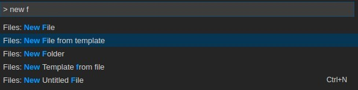

# VSCode Code Generator Extension
the initial code base on https://github.com/brpaz/vscode-file-templates-ext

## Usage
1. You can use `Gen:Create '.code-generator-templates' Folder` command to create default local workspace templates folder.
2. Once the templates folder created. there are a `template_common_data.json` file is also created. and a `@groups` folder also created.
3. When render template we need some data. so you can put your common data in the `template_common_data.json` file.
4. You can also use your current active editor's selection or the whole document text as an template data.
5. if you use your editor's text as template data, then it should be JSON format.
6. Normaly files in `.code-generator-templates` are single file templates. you can also put your group of templates file in the `@groups` folder.
7. **Note**: when create group of file from group templates,you should select a dest folder first.
8. Moreover,you can also store all of your templates and data file in a global folder. 

## Available Commands

* Create a new file from a template
* Create a new template from an existing file.

## Screenshots



## Install

On Visual Studio code, Press F1 to open the command menu and type ```ext install code-generator```.

**This extension was only tested on Mac. If you have a Linux or Windows and find some issue, please create a PR.**


## Variables

Variables can now be used in templates in the following way:

```
normal text #{variable_name}
```

When a file is created from the template, the user is prompted with a value to put here.

### Predefined variables

*  ```filename``` the output filename.

## Templates Location.

By default, this extension expects the file templates to be placed at the following location, depending of youur OS:

Linux:

```
$HOME/.config/Code/User/FileTemplates
```

Mac:

```
$HOME/Library/Application Support/Code/User/FileTemplates
```

Windows:

```
C:\Users\User\AppData\Roaming\Code\User\FileTemplates
```

However, you can change the default location by adding the following to your user or workspace settings:

```
"fileTemplates.templates_dir": "path/to/my/templates"
```

## Contributing

Please see [CONTRIBUTING.md](CONTRIBUTING.md) for details.


